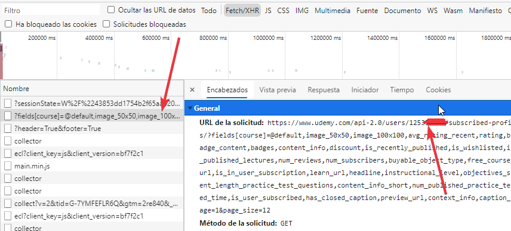

# __Buscador de cursos de un perfil - Udemy__

## __Captura__

## __¿Cómo obtener el user Id?__
1. Ubicarse en la página de un perfil público
2. Abrir la Herramienta de DevTools del navegador

3. Copiar el codigo del usuario
4. Por último, pegar el código y click en buscar

